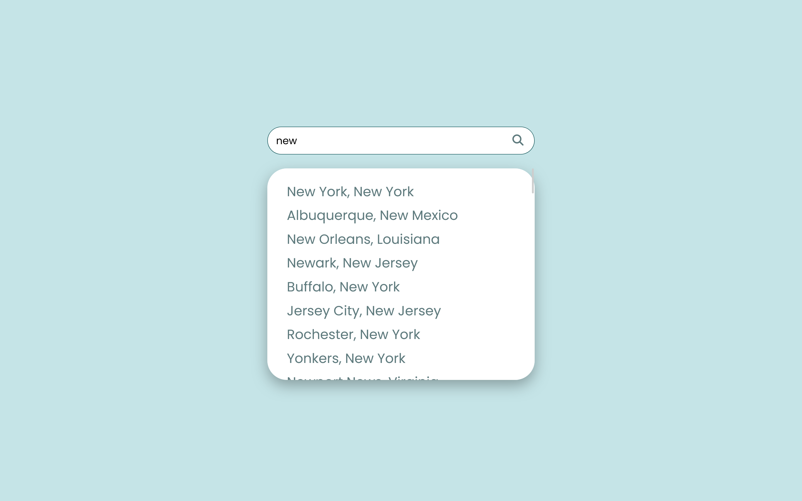
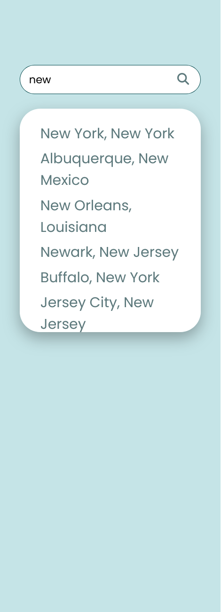
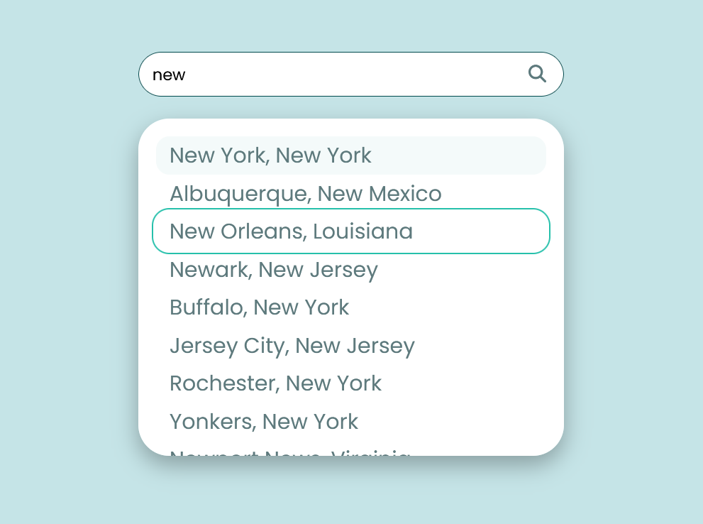

# Vue 3 + Vite

This template should help get you started developing with Vue 3 in Vite. The template uses Vue 3 `<script setup>` SFCs, check out the [script setup docs](https://v3.vuejs.org/api/sfc-script-setup.html#sfc-script-setup) to learn more.

## Recommended IDE Setup

- [VS Code](https://code.visualstudio.com/) + [Volar](https://marketplace.visualstudio.com/items?itemName=Vue.volar) (and disable Vetur) + [TypeScript Vue Plugin (Volar)](https://marketplace.visualstudio.com/items?itemName=Vue.vscode-typescript-vue-plugin).

## How to set up your development environment
1. Open the terminal in your VS code or open the git bash.
2. In the terminal, type `npm install`.
3. Boom! You are good to go. Please run the dev environment.

## How to Run the Dev Environment
1. Open the terminal in your VS code or open the git bash.
2. In the terminal, type `npm run dev`.
3. Click on the dev link seen in the terminal.
4. You are ready to see the timely refrehsed page in the dev environment whenever you save the codes!

## Screenshot

